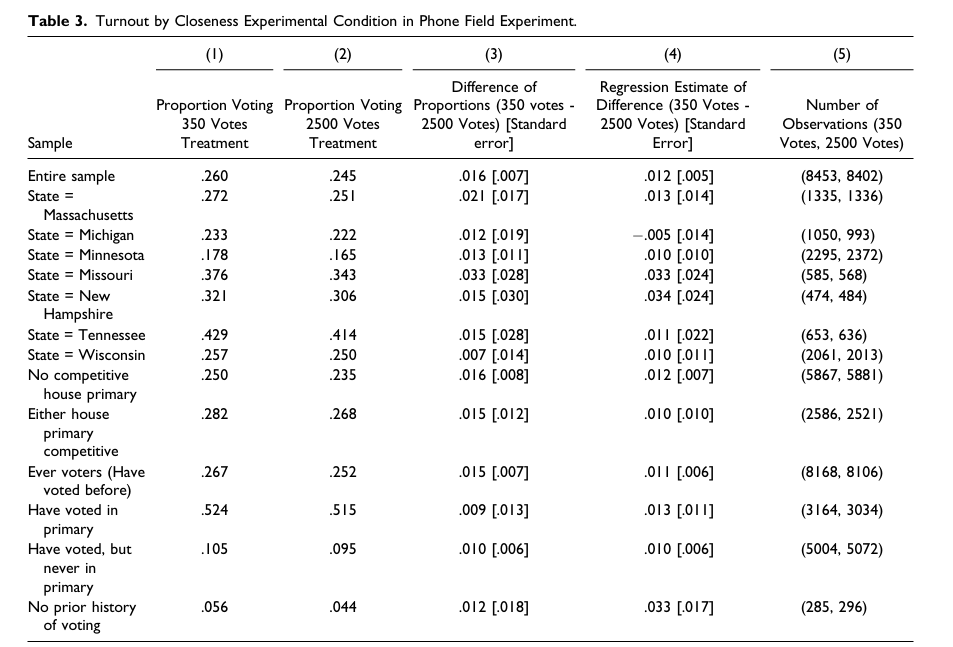

```{r setup, include=FALSE}
knitr::opts_chunk$set(echo = TRUE)
```

### Stata code explanation and R **Code Implementaion for "Messages Designed to Increase Perceived Electoral Closeness Increase Turnout"**

```{r}
# --------------------------------------------------------
## clear the environment var area
# rm(list = ls())
## clear all plots
# graphics.off()
## clear the console area
#cat("\014")
```

## Read the data

-   read DTA file

-   Transfer it from Stata data file (\*.dta) to csv format

```{r}
# library(haven)
# data = read_dta(
#   "./data/APRCloseElections_Final_Publication_Replication_Dataset.dta"
# )
```

```{r}
# write.csv(data, file = "./data/data.csv")
```

```{r}
data = read.csv('./data/data.csv')
```

This Stata code is part of a replication file for a study on the effects of perceived electoral closeness on voter turnout. The code performs various statistical analyses and outputs the results. Here's a breakdown of the code, part by part:

## Appendix Table A1: Balance Tests

1.  Multinomial logistic regression (`mlogit`) is performed to test the balance of covariates across different treatment groups. The `robust` option is used for robust standard errors, and `baseoutcome(1)` sets the reference category for the dependent variable.
2.  Local macros (`local`) are used to store statistics like p-values (`mlogitp`), degrees of freedom (`mlogitdf`), and chi-squared values (`mlogitchi`) from the model.
3.  A note (`tablenotes2`) is prepared, summarizing the balance test results, and displayed using the `display` command.
4.  `putexcel` commands are used to write the balance test results to an Excel file, creating a table with variable names, treatment groups, means, standard deviations, and the note prepared earlier.

```{r}
library(nnet)
mlogit_model <-
  multinom(
    a_phone_treat_relplacebo_passed ~ d_yearssincereg + d_yearssincereg_miss
    + d_electiondayage + d_gender_male + d_gender_unknown + d_race_black
    + d_race_latino + d_race_miss + d_race_other + d_genvotes + d_primvotes
    + d_specvotes,
    data = data,
    weights = data$weight_allstatestreats
  )
```

```{r}
summary(mlogit_model)
```

```{r warning=FALSE}
library(dplyr)

# Define the treatment groups and variables
treatments <-
  c("t_placebo", "t_info_only", "t_closeness_1", "t_closeness_2")
variables <-
  c(
    "d_yearssincereg",
    "d_yearssincereg_miss",
    "d_electiondayage",
    "d_gender_male",
    "d_gender_unknown",
    "d_race_black",
    "d_race_latino",
    "d_race_miss",
    "d_race_other",
    "d_genvotes",
    "d_primvotes",
    "d_specvotes"
  )

# Initialize an empty data frame for storing the summary statistics
summary_df <-
  data.frame(
    Variable = character(),
    Treatment = character(),
    Mean = numeric(),
    SD = numeric(),
    stringsAsFactors = FALSE
  )

# Loop through variables and treatments
for (var in variables) {
  for (treat in treatments) {
    treat_data <- data %>% filter(!!sym(treat) == 1)
    mean_val <-
      weighted.mean(treat_data[[var]], treat_data$weight_allstatestreats,
                    na.rm = TRUE)
    sd_val <- sd(treat_data[[var]], na.rm = TRUE)
    
    # Add the summary statistics to the data frame
    summary_df <-
      rbind(
        summary_df,
        data.frame(
          Variable = var,
          Treatment = treat,
          Mean = mean_val,
          SD = sd_val
        )
      )
  }
}

# Add observations count for each treatment
obs_counts <-
  sapply(treatments, function(treat)
    sum(data[[treat]] == 1, na.rm = TRUE))
obs_df <-
  data.frame(
    Variable = "Observations",
    Treatment = treatments,
    Mean = obs_counts,
    SD = NA
  )

# Combine summary statistics and observations count
final_df <- rbind(summary_df, obs_df)
TableA1_BalanceTests = final_df

# Save the data frame to a CSV file
write.csv(TableA1_BalanceTests,
          "./result/TableA1-BalanceTests.csv",
          row.names = FALSE)
```

```{r warning=FALSE}
# clear variables
remove(obs_df,
       summary_df,
       mean_val,
       obs_counts,
       sd_val,
       treat,
       treatments,
       var,
       variables,
       final_df)
```

## Table 2: Differences in Election and Turnout Context Across States

1.  `sum` commands calculate the turnout rates for placebo subjects in various states. Local macros store these proportions.
2.  Another `putexcel` set of commands creates an Excel table summarizing these turnout rates, along with information about the primary date, number of congressional districts, and the number of contested and uncontested primaries.

```{r}
# Calculate turnout rates for placebo subjects by state
turnout_rates <- data %>%
  filter(t_placebo == 1) %>%
  group_by(vf_state) %>%
  summarise(Turnout_Rate = mean(voted_2014_primary, na.rm = TRUE) * 100) %>%
  filter(vf_state %in% c("MA", "MI", "MN", "MO", "NH", "TN", "WI"))

# Define the state context information
state_context <- data.frame(
  State = c("Massachusetts", "Michigan", "Minnesota",
            "Missouri", "New Hampshire", "Tennessee", "Wisconsin"),
  Primary_Date = c("September 9", "August 5", "August 12",
                   "August 5", "September 9", "August 7", "August 12"),
  Number_of_Congressional_Districts = c(9, 14, 8, 8, 2, 9, 8),
  Democratic_Contested = c(2, 5, 1, 4, 0, 3, 3),
  Republican_Contested = c(1, 8, 2, 6, 2, 8, 5),
  Democratic_Uncontested = c(7, 9, 2, 3, 0, 5, 0),
  Republican_Uncontested = c(2, 6, 1, 1, 0, 1, 0)
)

# Merge turnout rates with the state context information
final_table <- cbind(state_context, turnout_rates)

# Rename and reorder columns to match the desired output
final_table <- final_table %>%
  select(State, Turnout_Rate,Primary_Date,
         Number_of_Congressional_Districts, 
         Democratic_Contested, Republican_Contested, 
         Democratic_Uncontested,
         Republican_Uncontested)
Table2_StateContext = final_table
# Save the table as a CSV file
write.csv(Table2_StateContext, "./result/Table2-StateContext.csv",
          row.names = FALSE)
```

```{r warning=FALSE}
remove(turnout_rates, state_context, final_table)
```

## Tables 3, A3, A5, and A7: Various Regressions and Proportions

-   Variables `close350not2500` and `ageunder50` are generated to represent treatment conditions and age groups, respectively.
-   The dataset is structured for panel data analysis using `xtset strata`.
-   A series of regression analyses are conducted to assess the impact of closeness treatments on voter turnout, interactions with age, and other covariates. Results are outputted to Excel files.
-   The `include` command suggests that another Stata script (`Closeness_SubProgramPRTestRegression.do`) is called multiple times to run specific regression models.

```{r}
data_T3 = data %>%
  mutate(
    close350not2500 = case_when(t_closeness_2 == 1 ~ 0,
                                t_closeness_1 == 1 ~ 1,
                                TRUE ~ NA_real_),
    ageunder50 = as.numeric(d_electiondayage < 50)
  )
```

```{r}
calculate_proportions <- function(subset_data) {
  # Ensure 'subset_data' is filtered based on our model
  # restrictions before passing to this function
  prop_test <-
    prop.test(
      x = sum(subset_data$voted_2014_primary[subset_data$close350not2500 == 1],
              na.rm = TRUE),
      n = sum(subset_data$close350not2500 == 1,
              na.rm = TRUE),
      p = mean(subset_data$voted_2014_primary[subset_data$close350not2500 == 0],
               na.rm = TRUE)
    )  # Setting correct=FALSE for a continuity correction
  return(prop_test)
}
# Regression Function
# This function will perform both linear and logistic regression
# based on the type parameter.
perform_regression <- function(subset_data, formula, type = "linear") {
  if (type == "linear") {
    # Linear regression
    model <- lm(formula, data = subset_data)
    tidy_model <- broom::tidy(model)
  } else if (type == "logistic") {
    # Logistic regression
    model <- glm(formula, data = subset_data, family = binomial())
    tidy_model <- broom::tidy(model)
  }
  return(tidy_model)
  # print(tidy_model)
}

```

```{r}
# Analysis for the Entire Sample
# No filter applied for the entire sample
entire_sample <- data_T3

# Proportion test
prop_test_entire <-
  prop.test(
    x = sum(entire_sample$voted_2014_primary[entire_sample$close350not2500 == 1],
            na.rm = TRUE),
    n = sum(entire_sample$close350not2500 == 1,
            na.rm = TRUE),
    p = mean(entire_sample$voted_2014_primary[entire_sample$close350not2500 == 0],
             na.rm = TRUE)
  )

# Linear regression
lm_entire <-
  lm(voted_2014_primary ~ close350not2500, data = entire_sample)

# Logistic regression
logit_entire <-
  glm(voted_2014_primary ~ close350not2500,
      data = entire_sample,
      family = binomial())

# Output the results (to console for simplicity, but you can write them
# to files or tables as needed)
summary(prop_test_entire)
summary(lm_entire)
summary(logit_entire)
remove(lm_entire,
       prop_test_entire,
       logit_entire,
       entire_sample)
```

```{r}
# Filter for Massachusetts
ma_sample <- data_T3 %>% filter(vf_state == "MA")

# Proportion test for Massachusetts
prop_test_ma <-
  prop.test(
    x = sum(ma_sample$voted_2014_primary[ma_sample$close350not2500 == 1],
            na.rm = TRUE),
    n = sum(ma_sample$close350not2500 == 1, na.rm = TRUE),
    p = mean(ma_sample$voted_2014_primary[ma_sample$close350not2500 == 0],
             na.rm = TRUE)
  )

# Linear regression for Massachusetts
lm_ma <- lm(voted_2014_primary ~ close350not2500, data = ma_sample)

# Logistic regression for Massachusetts
logit_ma <-
  glm(voted_2014_primary ~ close350not2500,
      data = ma_sample,
      family = binomial())

# Output the results for Massachusetts
summary(prop_test_ma)
summary(lm_ma)
summary(logit_ma)
remove(lm_ma,
       prop_test_ma,
       logit_ma,
       ma_sample)
```

Although I try to define the function, I cannot get the same results of Proportion and SE as the stata's.



------------------------------------------------------------------------

Table A2. Analysis of Intent to Vote in Election

------------------------------------------------------------------------

```{r}
library(tidyr)
# Filter out rows with NA in either intend_to_vote_maybeYes or close350not2500
filtered_data <- data_T3 %>%
  filter(!is.na(intend_to_vote_maybeYes) & !is.na(close350not2500))

# Now perform the proportion test with the filtered data
prop_test_result <-
  prop.test(x = table(
    filtered_data$intend_to_vote_maybeYes,
    filtered_data$close350not2500
  ))

# Print the result
print(prop_test_result)
remove(filtered_data,
       prop_test_result)
```

```{r}
# install.packages("survey")
# install.packages("lmtest")
library(survey)
library(sandwich)

# Create a survey design object to handle weights
design <- svydesign(ids = ~1, data = data_T3, weights = ~weight_allstatestreats)

# Fit a linear regression model using the survey design
model <- svyglm(intend_to_vote_maybeYes ~ close350not2500 + strata, design = design)

# Obtain robust standard errors using the vcovHC function from the sandwich package
robust_se <- sqrt(diag(vcovHC(model, type = "HC1")))

# You can print the coefficients and their robust standard errors like this:
coefs <- coef(model)
se <- robust_se

# Print the coefficients and robust standard errors
print(coefs)
print(se)
remove(design,
       model,
       robust_se,
       coefs,
       se)
```

## Figure 1 and Table A4: Comparative Effectiveness of Different Treatments

-   Regression analyses compare the effectiveness of different treatments on voter turnout.
-   `lincom` commands are used to compare the treatment effects.
-   Variables for plotting (`tvar`, `beta`, `beta_lowci`, `beta_hici`) are prepared, and a figure is generated using the `twoway` command, showing the estimated treatment effects with confidence intervals.
-   The figure is exported as a PDF, and unnecessary variables are dropped.

```{r}
library(survey)
library(lmtest)
library(sandwich)
library(ggplot2)

design <-
  svydesign(
    ids = ~ 1,
    data = data,
    weights = ~ weight_allstatestreats
  )

# Fit the model
model <-
  svyglm(voted_2014_primary ~ t_info_only + t_closeness_1
         + t_closeness_2 + strata,
         design = design)


# Obtain and print summary statistics
summary(model)

# Calculate robust standard errors
robust_se <- sqrt(diag(vcovHC(model, type = "HC1")))
```

```{r}
# Extract coefficients and confidence intervals
coefs <- coef(model)
cis <- confint(model)

# Create a data frame for plotting
plot_data <- data.frame(
  Treatment = c(
    "Election Reminder",
    "Closeness (350 Votes)",
    "Closeness (2500 Votes)"
  ),
  Effect = c(coefs["t_info_only"],
             coefs["t_closeness_1"],
             coefs["t_closeness_2"]),
  LowerCI = c(cis["t_info_only", 1],
              cis["t_closeness_1", 1],
              cis["t_closeness_2", 1]),
  UpperCI = c(cis["t_info_only", 2],
              cis["t_closeness_1", 2],
              cis["t_closeness_2", 2])
)
```

```{r}
ggplot(plot_data, aes(x = Treatment, y = Effect)) +
  geom_col() +
  geom_errorbar(aes(ymin = LowerCI, ymax = UpperCI), width = 0.2) +
  ylab("Estimated Treatment Effect (Relative to Placebo)") +
  xlab("") +
  theme_minimal()
```

## Table A6: Proportion Voting by Experimental Conditions, State, and Strata

-   Proportions of voting by experimental condition, state, and voter strata are calculated and outputted to an Excel file.
-   The `foreach` and `forvalues` loops iterate over treatment conditions, states, and voter history categories to summarize the data.

```{r}
library(dplyr)

# Calculate for the entire sample by treatment
results_entire <- data %>%
  group_by(treatment = coalesce(t_placebo, t_info_only,
                                t_closeness_1, t_closeness_2)) %>%
  summarize(
    Proportion_Voting = mean(voted_2014_primary, na.rm = TRUE),
    N = n(),
    .groups = 'drop'
  ) %>%
  mutate(Group = "Entire Sample")

# Calculate for each state as an example
results_state <- data %>%
  filter(vf_state == "MA") %>%  # Replace "MA" with other states as needed
  group_by(treatment = coalesce(t_placebo, t_info_only,
                                t_closeness_1, t_closeness_2)) %>%
  summarize(
    Proportion_Voting = mean(voted_2014_primary, na.rm = TRUE),
    N = n(),
    .groups = 'drop'
  ) %>%
  mutate(Group = "State=Massachusetts")

# Combine results
combined_results <- bind_rows(results_entire, results_state)

# Add more states and strata as needed
```

```{r}
write.csv(combined_results,
          "./result/table6-ProportionVotingByCondition.csv",
          row.names = FALSE)
```

## Table A8: Relationship Between Intention to Vote and Actual Turnout

-   A regression model explores the relationship between the intention to vote and actual turnout, considering the experimental condition and other covariates.
-   Results are outputted to an Excel file.

```{r}
library(survey)
library(lmtest)
library(sandwich)

# Define the survey design object
design <-
  svydesign(
    ids = ~ 1,
    data = data_T3,
    weights = ~ weight_allstatestreats
  )

# Fit the regression model with interaction terms
model <-
  svyglm(voted_2014_primary ~ intend_to_vote_maybeYes * close350not2500
         + strata,
         design = design)

# Calculate robust standard errors
robust_se <- sqrt(diag(vcovHC(model, type = "HC1")))
```

```{r}
# Extract model coefficients
coefs <- coef(model)

# Combine coefficients and robust SEs
results <- cbind(Estimate = coefs, `Robust SE` = robust_se)

# Convert to data frame for output
results_df <- as.data.frame(results)
```

```{r}
# Define the note to add to the CSV
# Note: OLS regression coefficients with robust standard errors in brackets.
# Dependent variable is voted in 2014 primary election (Yes = 1, No = 0). 
# Model includes state x voter history x district competitiveness
# fixed effects. Weighted analysis. ***p<0.01; **p<0.05; *p<0.1.

# Write the results and note to a CSV file
write.csv(results_df, "./result/TableA8-VoteIntent_Turnout.csv", row.names = TRUE)
```
